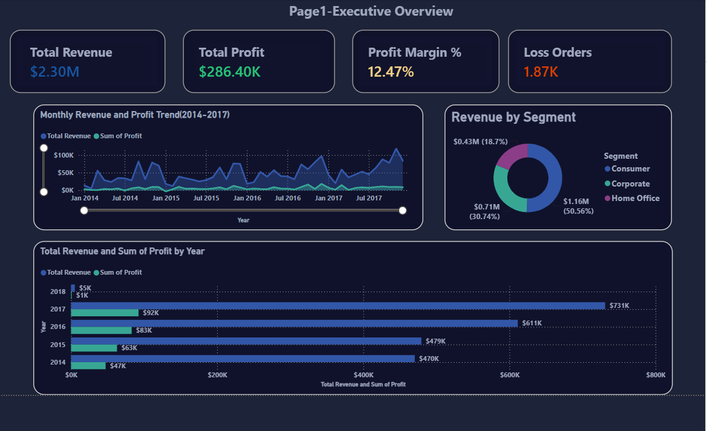
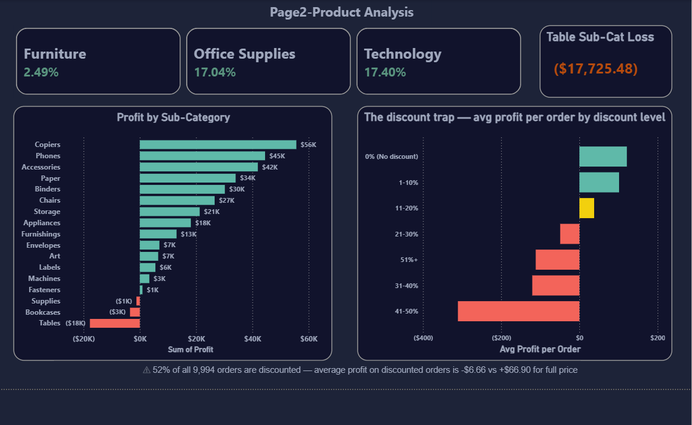
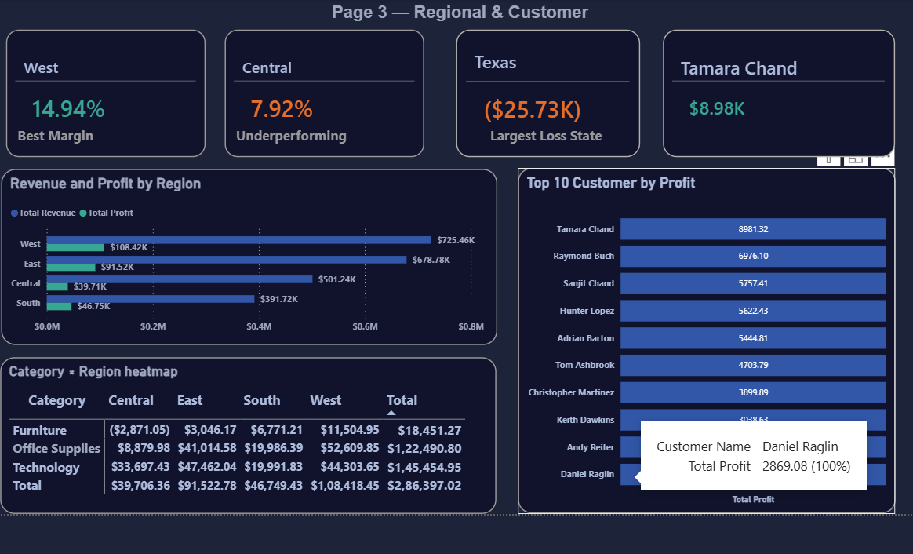

# Sales Performance & Profitability Analysis — Superstore

> Analysing 9,994 retail orders across 4 years to identify profitability drivers,
> discount impact, and regional performance gaps — with a 3-page interactive Power BI dashboard.

---

## Quick Stats

| | |
|---|---|
| **Dataset** | Sample Superstore — 9,994 orders, 21 features, 2014–2017 |
| **Total Revenue** | $2.30M across 4 years |
| **Total Profit** | $286.4K (12.5% overall margin) |
| **Tools** | Python · Pandas · Plotly · Power BI · DAX |
| **Dashboard** | [View Live on Power BI Service](your-powerbi-link-here) |
| **Notebook** | [Open in Google Colab](your-colab-link-here) |

---

## Key Findings

- 💡 **The Discount Trap** — 52% of all 9,994 orders are discounted. Discounted orders average **-$6.66 profit** per order vs **+$66.90** for full-price orders. Discounting is the single biggest cause of margin erosion in the business.

- 📦 **Furniture Problem** — Furniture generates 32% of total revenue but runs at only **2.5% profit margin** vs 17%+ for Technology and Office Supplies. The Tables sub-category alone **loses $17,725** on $207K revenue (-8.6% margin).

- 🗺️ **Regional Gap** — Central region runs at **7.9% margin** vs **14.9% in West** despite contributing 21.8% of total revenue. Heavy discounting in Central is the likely cause.

- 📍 **Loss-Making States** — Texas loses **$25,729**, Ohio loses **$17,000**, Pennsylvania loses **$15,600** despite being high-revenue markets.

- 📅 **Q4 Seasonality** — November and December consistently peak every year across all 4 years. Business should plan inventory and staffing to capture Q4 demand fully.

- ⭐ **Top Performers** — Copiers run at 37% margin, Paper at 43%, Labels at 44%. These sub-categories should be prioritised in sales and marketing.

---

## Dashboard Pages

### Page 1 — Executive Overview


KPI cards for Total Revenue, Total Profit, Profit Margin %, and Loss Orders.
Monthly revenue and profit trend across all 4 years with Q4 peaks highlighted.
Annual revenue vs profit clustered bar chart with YoY growth.
Revenue breakdown by customer segment (Consumer, Corporate, Home Office).

---

### Page 2 — Product Analysis


Profit by sub-category horizontal bar chart — loss-making sub-categories in red.
Category margin comparison (Furniture vs Office Supplies vs Technology).
The discount trap chart — average profit per order by discount level band.
Key insight callout: 52% discounted orders averaging -$6.66 profit.

---

### Page 3 — Regional & Customer


Revenue and profit by region with margin annotations.
Loss-making states highlighted with exact dollar loss values.
Top 10 customers ranked by total profit.
Category × Region profit heatmap — Central + Furniture = darkest red cell.

---

## Project Structure

```
superstore-sales-analysis/
│
├── README.md
│
├── notebook/
│   └── Superstore_Sales_Analysis.ipynb    ← Full EDA + analysis
│
├── data/
│   └── superstore_powerbi_ready.csv       ← Enriched dataset for Power BI
│
├── dashboard/
│   └── Superstore_Sales_Dashboard.pbix    ← Power BI dashboard file
│
└── images/
    ├── executive_overview.png
    ├── product_analysis.png
    └── regional_customer.png
```

---

## Notebook Contents

| Section | What it covers |
|---|---|
| 1. Setup | Libraries, colour palette, shared chart layout |
| 2. Load Data | CSV import, date parsing, first look |
| 3. Data Quality | Missing value check, duplicate check — dataset is clean |
| 4. Feature Engineering | 8 new columns: Year, Month, YearMonth, Quarter, ShipDays, ProfitMargin, IsLoss, IsDiscounted, DiscountBand |
| 5. Business Overview | KPI summary, annual revenue trend, monthly trend |
| 6. Category Analysis | Sub-category profit waterfall, category margin comparison |
| 7. Product Analysis | Top 10 and Bottom 10 products by profit |
| 8. Regional Analysis | Region performance, state-level profit breakdown |
| 9. Discount Analysis | The discount trap — profit by discount band |
| 10. Customer Analysis | Segment performance, top 10 customers, shipping analysis |
| 11. Summary | 5 key findings + 6 business recommendations |
| 12. Export | Enriched CSV exported for Power BI import |

---

## Power BI Dashboard — DAX Measures

12 custom DAX measures built for the dashboard:

```
Total Revenue        = SUM('superstore_powerbi_ready'[Sales])
Total Profit         = SUM('superstore_powerbi_ready'[Profit])
Profit Margin %      = DIVIDE([Total Profit], [Total Revenue], 0)
Total Orders         = DISTINCTCOUNT('superstore_powerbi_ready'[Order ID])
Total Customers      = DISTINCTCOUNT('superstore_powerbi_ready'[Customer ID])
Avg Order Value      = DIVIDE([Total Revenue], [Total Orders], 0)
Loss Orders          = SUM('superstore_powerbi_ready'[IsLoss])
Loss Order %         = DIVIDE([Loss Orders], [Total Orders], 0)
Discounted Orders %  = DIVIDE(SUM('superstore_powerbi_ready'[IsDiscounted]), [Total Orders], 0)
YoY Revenue Growth % = VAR CY = CALCULATE([Total Revenue], 'superstore_powerbi_ready'[Year] = 2017)
                       VAR PY = CALCULATE([Total Revenue], 'superstore_powerbi_ready'[Year] = 2016)
                       RETURN DIVIDE(CY - PY, PY, 0)
Avg Profit per Order = DIVIDE([Total Profit], [Total Orders], 0)
Total Quantity       = SUM('superstore_powerbi_ready'[Quantity])
```

---

## Business Recommendations

Based on the analysis, six actions are recommended:

1. **Set discount guardrails** — implement minimum margin thresholds before any discount is applied. Orders above 20% discount are almost always loss-making.

2. **Review Furniture pricing** — especially the Tables sub-category which loses $17,725. Either reprice or discontinue the least profitable lines.

3. **Investigate Central region** — 7.9% margin vs 14.9% in West. Likely over-discounting to win orders. A regional discount audit would identify the root cause.

4. **Push high-margin sub-categories** — Copiers (37%), Paper (43%), Labels (44%). These should be front-and-centre in sales campaigns.

5. **Plan for Q4** — November and December peak consistently. Stock inventory and increase staffing in Q3 to capture Q4 demand without fulfilment delays.

6. **Retain top customers** — top 10 customers by profit contribute disproportionately to total margin. A dedicated retention or loyalty programme for this segment would protect the most valuable revenue.

---


## About

**Prabhjot Singh**
Aspiring Data Analyst | Python · SQL · Power BI

📧 ps844601@gmail.com
🔗 [LinkedIn](https://linkedin.com/in/prabhjot-singh-35b17732a)
🐙 [GitHub](https://github.com/Ps1012)

---

*Dataset used for portfolio and learning purposes.*
